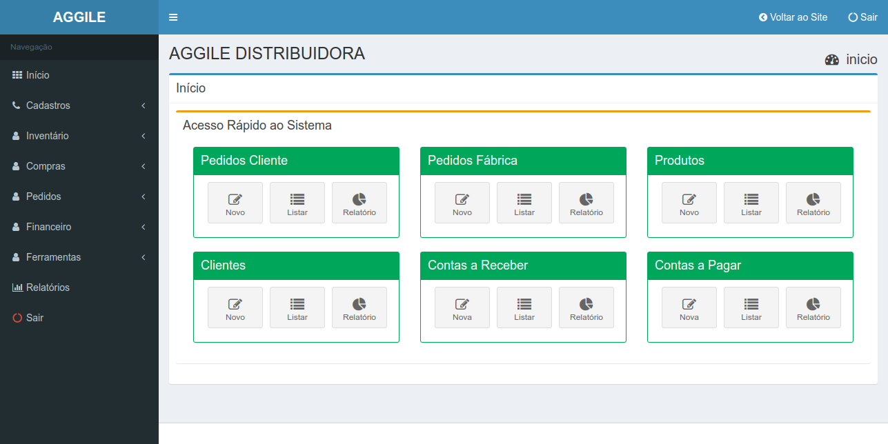

# Projeto Aggile Distribuidora

Sistema backend desenvolvido utiliazando Nodejs, Mysql, Mongo, Redis, Backbone, Jquery.

> Cadastros disponíveis:

* Cliente
* Vendedor
* Usuário
* Fábrica
* Cedente
* Produtos
    * Grupos
    * Unidades
    * Volumes

> Operações

* Inventário
    * Entrada e Saída
* Compras
    * Pedido Fábrica
    * Nota Fiscal
* Pedido Cliente
* Financeiro
    * Bancos
    * Agências
    * Contas Bancárias
    * Despesas
    * Receitas
    * Cheques
* Relatórios
    * Estoque
    * Clientes
    * Fabricas
    * Compras
    * Pedidos Fábrica
    * Pedido Clientes
        * Romaneio
        * Pedidos
    * Despesas
    * Receitas

